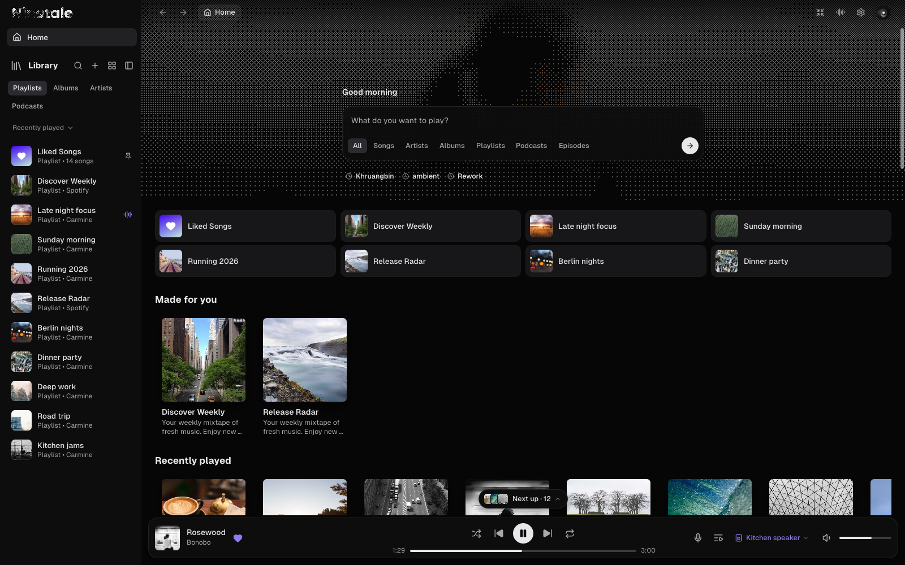

<h1 align="center">Spotifast Ninetale</h1>

<strong>Spotify, native and fast.</strong>

Spotifast Ninetale is a lightweight Spotify app for Windows. It is
written in Rust, has no browser engine, starts in under a
second and plays music through
[librespot](https://github.com/librespot-org/librespot). This edition
gives [Spotifast](https://github.com/crmne/spotifast) a new look:
dithered album art behind every page, a search box on Home, and a
floating player.

Playback needs Spotify Premium.

**[Download the latest release](https://github.com/kycloudy/spotifast-ninetails/releases/latest)**

Based on Spotifast by Carmine Paolino. [MIT license](LICENSE).
